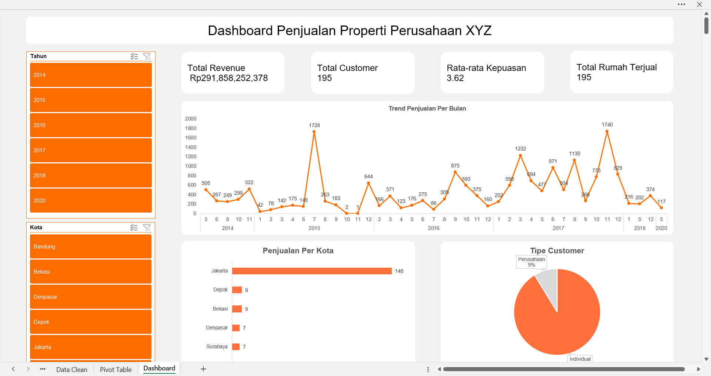

# 📊 Dashboard Penjualan Properti

Project ini merupakan **Dashboard Penjualan Properti** yang dibuat menggunakan **Microsoft Excel**. Dashboard ini menampilkan visualisasi data penjualan, tren bulanan, serta analisis performa penjualan properti secara interaktif dan mudah dipahami.

---

## 🗂️ Fitur Dashboard
- **Ringkasan Penjualan**  
  Menampilkan total unit terjual, pendapatan, dan rata-rata harga properti.  

- **Analisis Bulanan**  
  Grafik penjualan per bulan untuk melihat tren dan pola penjualan.  

- **Top Properti & Lokasi**  
  Daftar properti dan lokasi dengan performa penjualan terbaik.  

- **Filter Interaktif (Slicer & Timeline)**  
  Pengguna dapat memilih periode waktu, kategori, atau tipe properti untuk menampilkan data sesuai kebutuhan.  

---

## 📁 File Project
- **`Dashboard Penjualan Properti.xlsx`** → File Excel yang berisi data dan dashboard interaktif.

---

## 🖼️ Preview Dashboard
(Tambahkan screenshot dashboard di sini, contoh:)



---

## 🚀 Cara Menggunakan
1. Download atau clone repository ini.  
   ```bash
   git clone https://github.com/hastabdwn/dashboard-penjualan-properti.git
   ```
2. Buka file **Dashboard Penjualan Properti.xlsx** menggunakan Microsoft Excel (versi 2016 ke atas direkomendasikan).  
3. Gunakan filter/slicer untuk melihat analisis sesuai kebutuhan.  

---

## 📌 Catatan
- File ini menggunakan fitur **PivotTable, Slicer, dan Chart** pada Excel.  
- Jika dashboard tidak berjalan optimal, pastikan **macro/enable content** diaktifkan (jika ada).  

---

## 💡 Pengembangan Selanjutnya
- Menambahkan integrasi dengan **Google Sheets / Power BI**.  
- Menambahkan **dashboard otomatis** dengan data real-time.  
- Membuat versi berbasis **web app** untuk akses lebih luas.  

---

## 👨‍💻 Kontributor
- Hasta(https://github.com/hastabdwn)  
